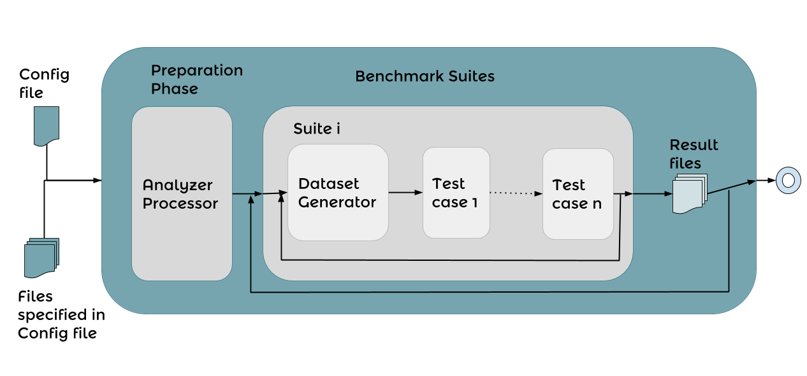
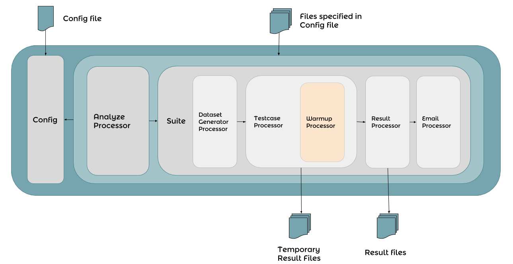

#IGUANA


##What is it?

IGUANA is a Benchmark execution Framework. IGUANA can test SPARQL Endpoints, as well as Federated SPARQL Systems with a Stress test, which means it can handle several users which request the endpoint with SPARQL Queries (ASK, CONSTRUCT, DESCRIBE, SELECT) while several update users will update (inserts and deletes) the triplestore. 

IGUANA can also analyze log files and get queries to test out of it. 
You can define several benchmark suites which work seperated of each other. In each suite you can define several testcases.

IGUANA gives you also the oppertunity to write own testcases and log analyzer without changing the code itself. IGUANA can be configured over one single config file.

----------

It should be...

+ ...easy to use
+ ...easy to configure
+ ...easy to install
+ ...understandable
+ ...well documented


For futher discussion we have a google group and mailing list: 

[Forum](https://groups.google.com/d/forum/iguana-aksw)

Mailing-List: iguana-aksw@googlegroups.com


##TOC
1. [Architecture](https://github.com/AKSW/IGUANA#architecture)
	1. [User](https://github.com/AKSW/IGUANA#user)
	2. [Developer](https://github.com/AKSW/IGUANA#developer)
3. [The latest version](https://github.com/AKSW/IGUANA#the-latest-version)
4. [Documentation](https://github.com/AKSW/IGUANA#documentation)
5. [Examples](https://github.com/AKSW/IGUANA#examples)
6. [Useful Tools](https://github.com/AKSW/IGUANA#useful-tools)
7. [Installation](https://github.com/AKSW/IGUANA#installation)
8. [Licensing](https://github.com/AKSW/IGUANA#licensing)
9. [Contacts](https://github.com/AKSW/IGUANA#contacts)

##Architecture
###User


###Developer


##The latest version

+ The latest version can always be found under the [master branch](https://github.com/AKSW/IGUANA/tree/master).
+ The simple jar file will be the iguana-x.y.z.jar file. 
+ The whole benchmark will be the iguana-x.y.z-distribution.zip file.

The Changelog can be found [here](https://github.com/AKSW/IGUANA/blob/master/CHANGELOG)

##Documentation

The documentation consist of the javadoc and the manual.

+ Tha JavaDoc can be found [here](http://aksw.github.io/IGUANA/javadoc/)
+ The Manuals can be found [here](https://github.com/AKSW/IGUANA/blob/master/release/)

##Examples

Example Configurations (v.0.3.0.2) are provided [here](https://github.com/AKSW/IGUANA/tree/master/examples). 

Be aware that these needs small adjustement (for example changing the endpoints)

##Useful Tools

BE AWARE THAT THESE TOOLS ARE NOT IN THE JAR FILE CURRENTLY! TO USE THEM DOWNLOAD THE SOURCE AND COMPILE IT YOURSELF
THE TOOLS WILL BE AVAILABE IN THE NEXT RELEASE (1.0)

IGUANA provides also some useful tools, like make a diff between two files. 

```
java -Xmx8g -cp "./lib/*" org.aksw.iguana.utils.Diff Dump1.nt Dump2.nt
```

It will result in 3 files called: in_both.nt, only_in_first.nt and only_in_second.nt


Further on it can dump a whole Triplestore with the following copmmand:

```
java -Xmx8g -cp "./lib/*" org.aksw.iguana.utils.Dumper http://dbpedia.org/sparql 10000
```

It will result in a file called dump.nt which has all Triples gained by the Query: `SELECT * {?s ?p ?o}`
The second argument '10000' is needed, so it will not gain every Triple at once but in Blocks of 10000 (or whatever you whish).  


If you diff two files and need the output to create changesets you  can use this command: 

```
java -Xmx8g -cp "./lib/*" org.aksw.iguana.utils.ChangesetDivider file_to_add.nt file_to_remove.nt 200
```
This will result in (max) 200 files to add and (max) 200 files to remove with the same no. of triples in each file.


To recalculate your results use this:

```
java -Xmx8g -cp "./lib/*" org.aksw.iguana.utils.ResultReader ./results_0/org.aksw.iguana.testcases.StressTestcase1.0/
```

The output will be a folder called results_test

##Installation

Please see the file called [INSTALL](https://github.com/AKSW/IGUANA/blob/master/INSTALL).

##Licensing

IGUANA is licensed under the LGPL License
Please see the file called [LICENSE](https://github.com/AKSW/IGUANA/blob/master/LICENSE)

The (not anymore whole) list of libraries we use and their licenses is stated in the file called [LIBRARIES](https://github.com/AKSW/IGUANA/blob/master/LIBRARIES)

##Contacts

+ If you want to be informed about new releases, bug fixes, ... about IGUANA subscribe to the github repository
+ If you found a bug please report it [here](https://github.com/AKSW/IGUANA/issues) and please describe the bug as much as possible. 
+ If you want support please contact one of the contributors. We can't ensure you to help but at least you can ask us.
