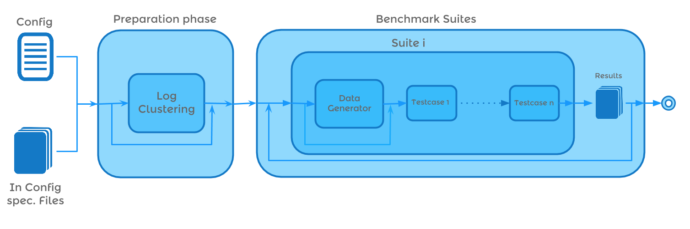

#IGUANA

##What is it?

IGUANA is a Benchmark execution Framework. IGUANA can test SPARQL Endpoints, as well as Federated SPARQL Systems with a Stress test, which means it can handle several users which request the endpoint with SPARQL Queries (ASK, CONSTRUCT, DESCRIBE, SELECT) while several update users will update (inserts and deletes) the triplestore. 
IGUANA can also analyze log files and get queries to test out of it. 
You can define several benchmark suites which work seperated of each other. In each suite you can define several testcases.
IGUANA gives you also the oppertunity to write own testcases and log analyzer without changing the code itself. IGUANA can be configured over one single config file.

It should be...

+ ...easy to use
+ ...easy to configure
+ ...easy to install
+ ...understandable
+ ...well documented

##Architecture
###User

###Developer

##The latest version

+ The latest version can always be found under the [master branch](https://github.com/AKSW/IGUANA/tree/master).
+ The simple jar file will be the iguana-x.y.z.jar file. 
+ The whole benchmark will be the iguana-x.y.z-distribution.zip file.

The Changelog can be found [here](https://github.com/AKSW/IGUANA/blob/master/CHANGELOG)

##Documentation

The documentation consist of the javadoc and the manual.

+ Tha JavaDoc can be found [here](http://aksw.github.io/IGUANA/javadoc/)
+ The Manual can be found [here](https://github.com/AKSW/IGUANA/blob/master/MANUAL.pdf)

##Examples

Example Configurations are provided [here](http://aksw.github.com/AKSW/IGUANA/blob/develop/examples/). Be aware that these needs small adjustement (for example changing the endpoints)

##Installation

Please see the file called [INSTALL](https://github.com/AKSW/IGUANA/blob/master/INSTALL).

##Licensing

IGUANA is licensed under the LGPL License
Please see the file called [LICENSE](https://github.com/AKSW/IGUANA/blob/master/LICENSE)

The (not anymore whole) list of libraries we use and their licenses is stated in the file called [LIBRARIES](https://github.com/AKSW/IGUANA/blob/master/LIBRARIES)

##Contacts

+ If you want to be informed about new releases, bug fixes, ... about IGUANA subscribe to the github repository
+ If you found a bug please report it [here](https://github.com/AKSW/IGUANA/issues) and please describe the bug as much as possible. 
+ If you want support please contact one of the contributors. We can't ensure you to help but at least you can ask us.
